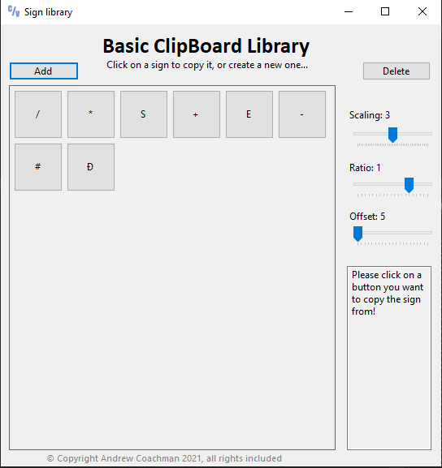
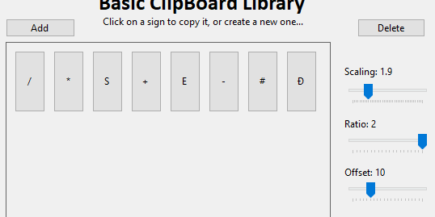

# Clipboard Picker
Clipboard picker is a simple Winforms desktop app made for storing specific text characters.

You can create many buttons representing different characters that are hard or even impossible to type on a keyboard and have them ready when you need them. 

The special character gets copied into your clipboard when you click on the button of your choice!

## The Interface

    

The buttons can be resized in many ways with the sliders to create the right conditions to copy easily.

    

A simple add window allows for custom creation of character buttons to copy from.
- Button description can be added and then viewed on the bottom right.

    

It is possible to delete any existing button from the interface with the help of this window.
- The 'Remove all occurences' checkbox removes duplicates of the same sign.

    

## Planned updates
- Adding a feature to copy whole texts.
- Adding a feature to display and copy ASCII art.

*© Copyright Andrew Coachman 2021, all rights included*